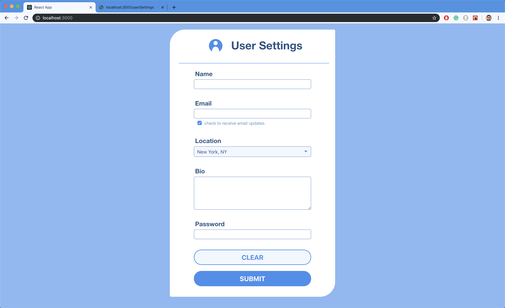
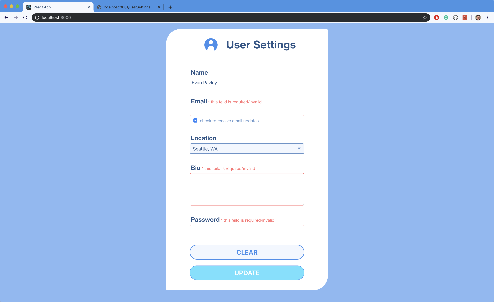

# User Settings Project Front-end

This is a simple user settings page that I designed and built to test out using a react front-end with a Node JS, Express and MongoDB back-end

The form has many validations on the front and back-end

run '$npm start' to use

## Built with
[React](https://reactjs.org/) - web library used for building the interface
[CSS](https://developer.mozilla.org/en-US/docs/Web/CSS) - For styling
[Node JS](https://nodejs.org/en/) - To create the server.
[Express](https://expressjs.com/) - With Node to create the server, simplifies routing and more.
[Nodemon](https://nodemon.io/) - Automatically restarts the server when the files change.
[Body-parser](https://www.npmjs.com/package/body-parser) - body parsing middleware for Node JS to extract the body portion of an incoming request.
[MongoDB](https://www.mongodb.com/) - To sustain the database.
[Mongoose](https://mongoosejs.com/) - For object modeling with MongoDB.

## Additional Notes
[Backend repo](https://github.com/EvanPavley/user-backend)
